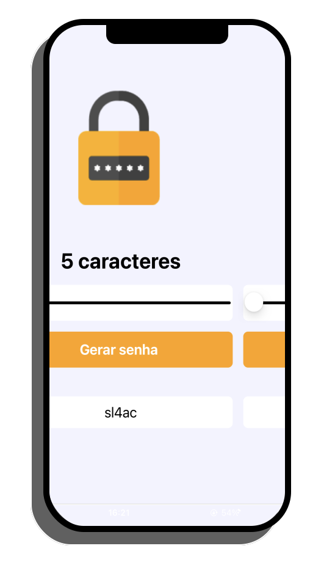

# APP Gerador de senhas



# Projeto criado com React Native e expo, nas aulas do React Native Insider do canal Sujeito Programador

> link para as aulas: https://www.youtube.com/channel/UCLc5Bq2yfs-S3Zse3ZFRMEQ

## 💻 Pré-requisitos

Antes de começar, verifique se você atendeu aos seguintes requisitos:

<!---Estes são apenas requisitos de exemplo. Adicionar, duplicar ou remover conforme necessário--->

- Tenha intalado em seu computador o expo e o node.
- Depois de intalado, na pasta do projeto abra seu terminal e coloque o comando $ expo start

## 🚀 Instalando

Para instalar o expo no seu computador, siga estas etapas:

Linux e macOS:

```
Para linux e Mac abra o link em seu navegador e siga as orientações.
https://docs.expo.io
```

Windows:

```
$ npm install --global expo-cli
```
